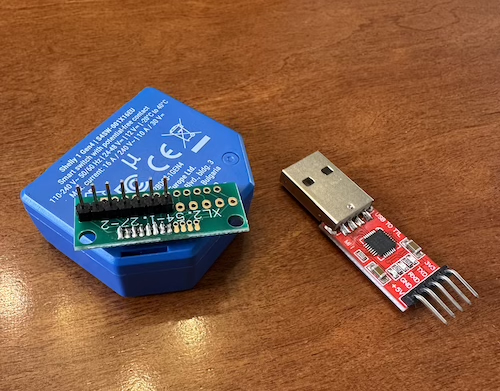
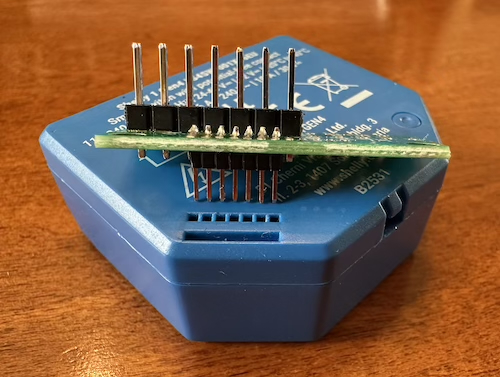
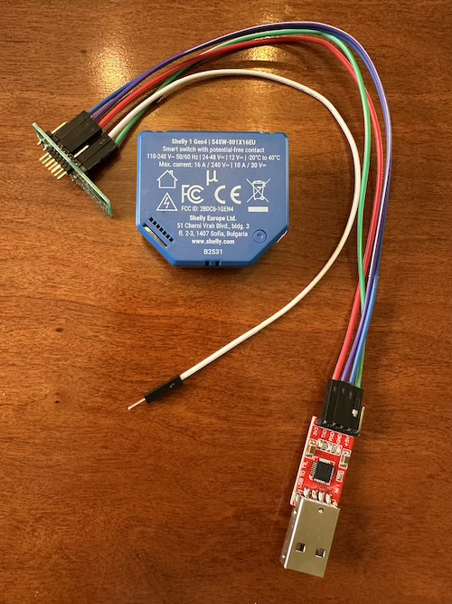

# Flashing Guide

[← Back to README](../README.md) · [Report an issue](../../../issues/new)

This guide covers flashing the Automatous Matter over Thread firmware onto a Shelly 1 Gen4. The full process takes about 15 minutes: 5 minutes to wire up, 5–10 minutes to back up the original firmware, and 1–2 minutes to flash the new firmware.

---

## Safety Warning

> ⚠️ **Never connect the Shelly to AC mains while flashing.** The programming header is not galvanically isolated from the relay circuitry. Connecting the Shelly to mains voltage AND a USB-UART adapter simultaneously can cause:
> - Personal electrocution risk
> - Permanent destruction of the Shelly
> - Permanent destruction of your computer's USB port (or the entire computer)
>
> Always flash the Shelly powered only by the 3.3V line from the USB-UART adapter, with no other connections to the device. Do not flash a Shelly that is installed in a wall, junction box, or any AC-connected fixture. Remove the Shelly entirely from any AC wiring before flashing.

> 💡 **Bench testing note.** The Shelly can be fully flashed, commissioned, and tested over the USB-UART 3.3V line — but **the relay will not physically click at 3.3V**. The relay coil needs full mains voltage to actuate. Bench testing over 3.3V verifies firmware flash success, Matter commissioning, GPIO behavior, LED states, and that your smart home app can send commands. You will not hear the relay click during bench testing. This is expected, not a bug. Verify everything else works first, then install with confidence and skip the headache of pulling the Shelly back out of the wall if something didn't work.


## Contents

- [Safety Warning](#safety-warning)
- [Hardware Revision](#hardware-revision)
- [What you will need](#what-you-will-need)
- [CP2102 to Shelly Wiring](#cp2102-to-shelly-wiring)
- [Enter Flash Mode](#enter-flash-mode)
- [Flash with ESPConnect](#flash-with-espconnect)
- [Restoring stock firmware](#restoring-stock-firmware)
- [Command line flashing with esptool (advanced)](#command-line-flashing-with-esptool-advanced)

---

## Hardware Revision

Tested on Shelly 1 Gen4 hardware revision **v0.1.2** (printed on the PCB). Other revisions should work but have not been verified — if you have a different revision, please [open an issue](../../../issues/new) with your findings.

 
## What you will need
- Shelly 1 Gen4
- CP2102 USB-UART adapter
- 1.27mm 7-pin to 2.54mm Dupont custom cable or adapter board [(see pinout)](#cp2102-to-shelly-wiring)
- Chrome, Edge, or any Chromium-based browser (for Web Serial) or esptool via CLI
- (Optional) A separate serial monitor for viewing boot logs after flashing — see [Verify the firmware is running](#5-verify-the-firmware-is-running)

> Solid core Cat 5e / 6 ethernet wires should fit into the female square holes on the Shelly if you don't want to custom make an adapter or solder to flash - although much harder and finicky to manage. I purchased a small adapter board and soldered both 1.27mm and 2.54mm pins to it and utilized Dupont wires, as pictured below.

## CP2102 to Shelly Wiring

> Full pinout and hardware overview: [Shelly 1 Gen4 Knowledge Base](https://kb.shelly.cloud/knowledge-base/shelly-1-gen4-anz)

| CP2102 | Shelly 1 Gen4 |
|--------|---------------|
| N/A | Pin 1 (ESP_DBG_UART) |
| RXD | Pin 2 (TXD) |
| TXD | Pin 3 (RXD) |
| 3.3V | Pin 4 (3.3V)|
| N/A | Pin 5 (RESET) |
| N/A | Pin 6 (GPIO0 - BOOT)|
| GND | Pin 7 (GND) |

> The crossover is built into the table above: connect CP2102 RXD to Shelly TXD, and CP2102 TXD to Shelly RXD. If you're wiring this from the CP2102's "TX" and "RX" labels directly to the Shelly's "TX" and "RX" labels without crossing, it will not work.

> **Do not connect the 5V pin.** The Shelly programming header is 3.3V only — applying 5V will likely permanently damage the ESP32-C6 and brick the device. Many CP2102 boards have both 3.3V and 5V pins; verify you are using the 3.3V pin before connecting.



*The Shelly 1 Gen4 with the flashing adapter mounted, alongside a CP2102 USB-UART adapter.*



*The 1.27mm-to-2.54mm adapter board seated next to the Shelly's 7-pin programming header.*



*Full flashing setup: Shelly's programming header connected to the CP2102 via Dupont wires, with the GPIO0-to-GND jumper visible (white wire) for entering flash mode.*

## Enter Flash Mode

The Shelly enters bootloader (flash) mode when GPIO0 is held low at power-up.

1. **Disconnect** the 3.3V line if currently connected.
2. **Bridge** Pin 6 (GPIO0) to Pin 7 (GND) — keep them connected.
3. **Connect** the 3.3V line to power the device. The Shelly boots into flash mode.
4. You can now leave the GPIO0–GND bridge in place for the duration of flashing, or remove it after a second or two — either works once the bootloader is running.

## Flash with ESPConnect

ESPConnect is a browser-based ESP32 flashing tool built on Web Serial. No installation required — works in Chrome, Edge, or any Chromium-based browser on macOS, Windows, and Linux.

### 1. Connect to the Shelly

1. Put the Shelly into flash mode (Pin 6 GPIO0 bridged to Pin 7 GND, then power up via 3.3V).
2. Open [ESPConnect](https://thelastoutpostworkshop.github.io/microcontroller_devkit/espconnect/) in your browser.
3. Click **Connect** and select your USB-UART serial port from the browser dialog.
4. Set baud rate to **115200**. Slower than the default, but more reliable for the long backup read.
5. ESPConnect will display chip info confirming the ESP32-C6 is detected, including the device's **MAC address** — note this down, you'll use it to label your backup file. If you see "Failed to connect" or no chip info, the Shelly is not in flash mode — recheck the GPIO0–GND bridge and re-power the device.

### 2. Back up the original Shelly firmware

> This step is essential. The backup is the only way to restore your device to its factory state. **Do not skip it**.

1. In the left navigation, click **Flash Tools**.
2. Click **Download Flash Backup**.
3. ESPConnect will read the entire 8MB flash and download it as a `.bin` file. This takes 5–10 minutes at 115200 baud — do not disconnect or close the browser during the read.
4. Rename the downloaded file to include the device's MAC address, e.g. `shelly-1-gen4-stock-AABBCCDDEEFF.bin`.
5. **Verify the file size is approximately 8 MB (8,388,608 bytes).** A smaller file means the read was incomplete or interrupted; redo the backup before proceeding.
6. Store the backup somewhere safe. If you are flashing multiple Shellies, keep each MAC-labeled backup separate — they should not be interchanged.

### 3. Flash the Automatous firmware

1. Still in **Flash Tools**, click **Flash Firmware**.
2. Select the latest release `.bin` from your downloads.
3. Set flash offset to `0x0`.
4. Check **Erase entire flash before writing**.
5. Click **Flash** and wait for the operation to complete (1–2 minutes). ESPConnect shows a progress bar and a success message when done.

### 4. Boot the new firmware

1. Disconnect from ESPConnect (click **Disconnect** or close the tab).
2. **Remove the GPIO0 ↔ GND bridge.** This is critical — if GPIO0 is still bridged to GND at the next power-up, the Shelly will boot back into flash mode instead of running your firmware.
3. Power-cycle the Shelly: disconnect the 3.3V line, wait two seconds, reconnect.
4. The Shelly is now running the Automatous firmware and is in BLE commissioning mode, ready to be added to your smart home ecosystem.

### 5. Verify the firmware is running

After power-cycling, the Shelly is running your firmware and advertising for Matter commissioning over BLE. You can verify it's working in three ways:

**Easiest: look at the LED.** If you see a rapid blink (~200ms on, 200ms off), the firmware is running and advertising for Matter commissioning. You can proceed directly to [Commissioning](../README.md#commissioning). See the [Status LED Reference](../README.md#status-led-reference) in the README for what each pattern means.

**Try to add it from your smart home app.** Open Apple Home, Google Home, Alexa, or Home Assistant and start the "add device" flow. If the Shelly appears as a discoverable Matter device, the firmware is running correctly.

**For developers / troubleshooting:** ESPConnect requires flash mode and cannot show normal application serial output easily from my experience with this project. Use a separate serial monitor instead:

- **macOS / Linux CLI:** `screen /dev/cu.usbserial-XXXX 115200` or `idf.py -p /dev/cu.usbserial-XXXX monitor` if you have ESP-IDF installed (replace with your actual port)
- **Windows:** [PuTTY](https://putty.org/index.html) configured for Serial at 115200 baud
- **VS Code:** the Serial Monitor extension

You should see boot logs followed by `Commissioning Window Opened`. This confirms Matter is initialized and the device is advertising.

> ⚠️ **Important:** With your firmware running, do not bridge GPIO0 to GND again unless you want to re-enter flash mode. The USB-UART 3.3V line can stay connected for power and serial monitoring during commissioning — just leave Pin 6 (GPIO0) disconnected.

## Restoring stock firmware

> ✅ **Stock restore is verified working** — your Shelly will create its `shelly-XXXXXX` setup AP, pair with the Shelly app, and behave identically to a factory unit.

If you want to revert to the original Shelly firmware:

1. Put the Shelly back into flash mode (GPIO0 ↔ GND, power up via 3.3V).
2. In ESPConnect, click **Flash Firmware**.
3. Select the `.bin` backup file you saved earlier (matching this device's MAC address).
4. Set flash offset to `0x0`, check **Erase entire flash before writing**, click **Flash**.
5. Power-cycle the Shelly. It will boot the restored firmware and behave as factory.

## Command line flashing with esptool (advanced)

Requires [esptool](https://github.com/espressif/esptool) installed. On macOS/Linux: `pip install esptool`. On Windows: install via pip, or download the standalone binary from the releases page.

Throughout these commands, replace:
- `<PORT>` with your serial port (`/dev/cu.usbserial-XXXX` on macOS, `/dev/ttyUSB0` on Linux, `COM3` on Windows)
- `<MAC>` with the Shelly's MAC address (read from `chip_id` below)
- `<VERSION>` with the firmware release version (e.g. `v1.0.0`)

Put the Shelly into flash mode before each command (GPIO0 bridged to GND, then power up via 3.3V).

**Identify the chip and read the MAC address:**

Device information that includes Mac Address:
```bash
esptool.py --chip esp32c6 --port <PORT> --baud 115200 chip_id
```

Backup your original firmware:

```bash
esptool.py --chip esp32c6 --port <PORT> --baud 115200 \
  read_flash 0x0 0x800000 shelly-1-gen4-stock-<MAC>.bin
```
This reads the entire 8 MB flash. Verify the resulting file is exactly 8,388,608 bytes before proceeding.

Erase flash:
```bash
esptool.py --chip esp32c6 --port <PORT> --baud 115200 erase_flash
```
 
**Flash the Automatous firmware:**

```bash
esptool.py --chip esp32c6 --port <PORT> --baud 115200 \
  write_flash 0x0 automatous-io-shelly-1-gen4-light-<VERSION>.bin
```
 
**Restore the original firmware:**

```bash
esptool.py --chip esp32c6 --port <PORT> --baud 115200 \
  write_flash 0x0 shelly-1-gen4-stock-<MAC>.bin
```

After flashing, remove the GPIO0–GND bridge and power-cycle the Shelly to boot the new firmware.

[← Back to README](../README.md)